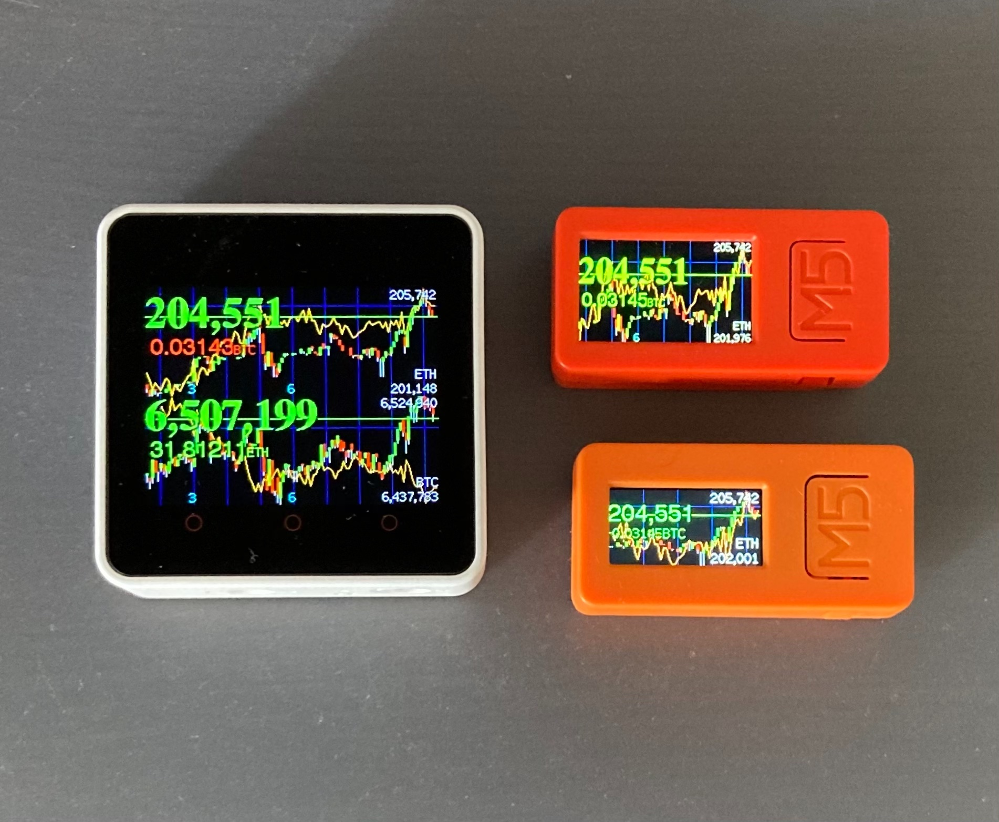

# CryptoCurrencyCandlesticks



This is a program which turns a US$10 cheap ESP32 device with color LCD display (TTGO) into a candlestick display terminal for Ethereum. At this point, it just supports the pair of Ethereum and Japanese Yen.

This program uses Bitbank's public API to obtain candlesticks. The specifications of the API are shown at: https://github.com/bitbankinc/bitbank-api-docs
This program uses public candlestick API written here: https://github.com/bitbankinc/bitbank-api-docs/blob/master/public-api.md
You do not have to obtain API key to access the API.

## Requirements

The following are required to compile and run this program:

- TTGO-T-ESP32, which can be baught from such as https://www.aliexpress.com/item/33048962331.html
- TTGO-T-Display library for Arduino which can be downloaded from: https://github.com/Xinyuan-LilyGO/TTGO-T-Display
- ArduinoJson library which can be downloaded from: https://arduinojson.org/
- Root certification for bitbank.cc which is already included within this source code.
- Arduino IDE to compile and transfer the compiled executable into ESP32 device.
- WiFi access information which should be placed in auth.h (not included in this repository) which includes the following information:

```
#define WIFIAP "your WiFi access point name"
#define WIFIPW "your WiFi access point password"
```

## Future updates

I purchased another TTGO-T-ESP32, and I will develop Bitcoin version. I anticipate that it will take a few weeks until the new one will arrive.

I do not have any plan to support any other currency nor fiat currency. In addition, I do not have any plan to support any other API provided by other Cryptocurrency exchanges.

## Issues

Delimiter is not properly shown https://github.com/konakira/CryptoCurrencyCandleSticks/issues/1#issue-818158019
