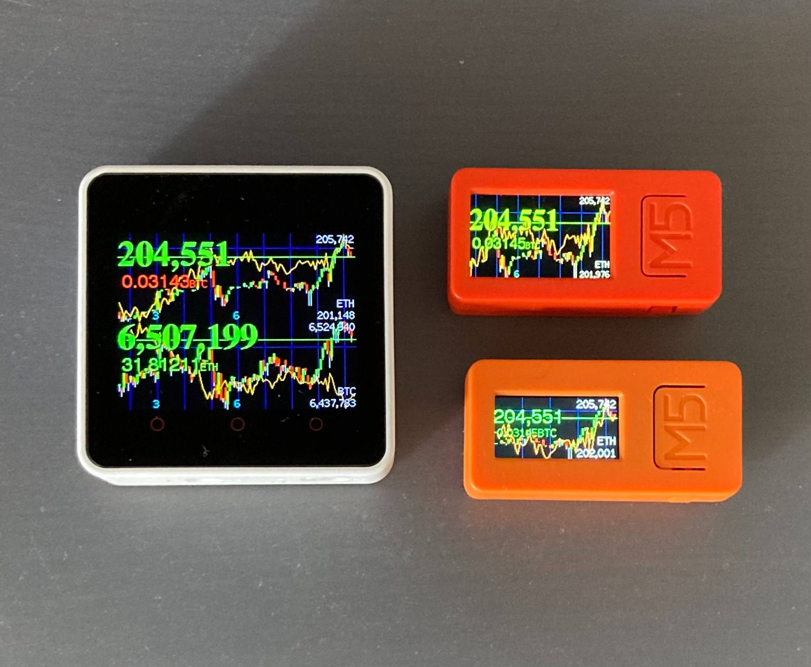
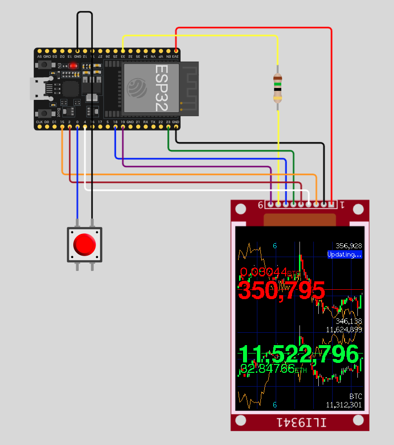

# CryptoCurrencyCandlesticks

A real-time cryptocurrency candlestick chart display terminal for ESP32 and M5Stack series devices. It fetches data from the bitbank.cc API to render live market movements directly on your desktop.

The specifications of the API can be found here: https://github.com/bitbankinc/bitbank-api-docs
This program uses the public candlestick API documented here: https://github.com/bitbankinc/bitbank-api-docs/blob/master/public-api.md
**No API key is required** to access this API.

## Key Features

* **Dynamic Dual Display:** Automatically adapts to your device's screen resolution. Enjoy a split-screen view showing both BTC and ETH simultaneously on larger screens (like M5Stack Core2), or toggle between them seamlessly on compact devices.
* **Smart Visual Alerts:** Never miss a critical market movement. The entire (or a large part of) the screen actively flashes (Green for surges, Red for drops) when breaking today's high/low, or when detecting a sudden price change (e.g., >1% movement) within a 1-minute or 5-minute window.
* **Multi-Currency Tracking:** Tracks BTC/JPY and ETH/JPY pairs by default, rendering 5-minute candlestick charts with real-time ticker updates.
* **Relative Strength Tracker:** Features a cleverly overlaid orange line graph that visualizes the real-time relative value (ratio) between the two tracked cryptocurrencies.
* **Universal Compatibility:** A single, unified codebase powered by PlatformIO. It supports a wide range of devices including M5StickC/Plus, M5Stack Core2, M5StickS3 (M5Unified), and custom ESP32/ESP32-C6 setups.

## Button Operations

You can interact with the device (or the simulated buttons in Wokwi) to control the display:

* **Switch Currency:** Toggle the main display between **ETH/JPY** and **BTC/JPY**.
* **Split Screen Mode:** On high-resolution displays (e.g., 320x240), you can switch between a single chart and a **dual-chart mode** to monitor both currencies simultaneously.
* **Screen Rotation:** Cycle through different screen orientations (Landscape/Portrait) to fit your setup.
* **Dismiss Alerts:** If a significant price change triggers a flash alert, press any button to return to the normal chart view.

*(Note: On the Wokwi simulator, simply click the red push buttons to trigger these actions.)*

## Setup & Configuration

1. Rename `auth.h.example` to `auth.h` and enter your Wi-Fi credentials.
2. Select your target environment in PlatformIO (e.g., `env:m5stick-c-plus`, `env:m5stack-core2`, `env:m5stick_s3`).
3. Build and upload!

## Wokwi Simulator

You can experience how this project works on the Wokwi simulator, even without the physical hardware. Please keep in mind that the simulation runs significantly slower than the actual device, and network errors may occur frequently due to the limitations of the virtual environment.

